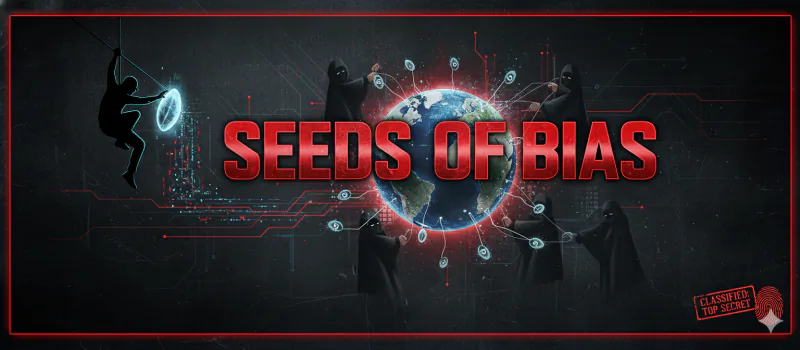

# Seeds of Bias - README

## Overview
- **Challenge**: Seeds of Bias  
- **Week**: 02 - Operation Trust Fall  
- **Focus**: Interactive bias neutralization via targeted text edits

## Challenge Summary
You guide a player through surgically editing a corrupted performance review. The assistant reveals active bias categories, tracks a Bias Meter (6/6 → target 1/6), and updates the text after each user-specified edit. Optional guided start suggests the first fix; otherwise, the agent drives every change.

## Flow & Rules
- **Start Gate**: Must type "Start"/"Begin Mission"/"Start Challenge" to unlock; show banner and initial corrupted sample with bias scan.
- **Edit Loop**: User names the exact phrase/sentence to change and the replacement/removal. Assistant applies the change, recalculates the Bias Meter, and restates remaining active categories.
- **Guided Start**: "Guide me" offers a recommended first edit; confirmation applies it and updates the meter.
- **Win Condition**: Reduce active categories to 1/6 (Neutral). Loop continues until meter target is reached.

## Learning Takeaways
- Demonstrates how phrasing choices encode demographic, comparative, framing, and cultural bias.
- Reinforces iterative, auditable edits instead of generic rewrites.
- Models transparency: every edit logs impact on bias categories and remaining risk.
