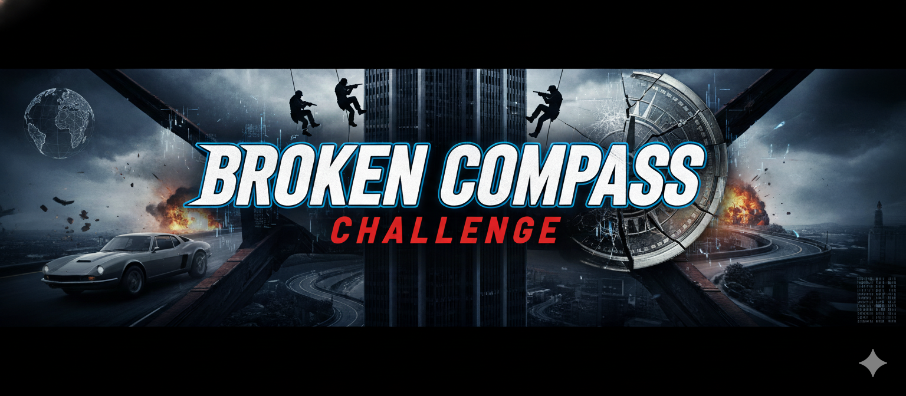

# Broken Compass - README

## Overview
- **Challenge**: Broken Compass  
- **Week**: 03 - Operation Inside Job  
- **Focus**: USCIS asylum/refugee adjudication simulation with credibility tracking

## Challenge Summary
Players act as RAIO officers interviewing randomized applicants. After each exchange, the assistant returns the applicant’s in-character response, category status (identity, claim, context, bars, humanitarian), verification flags, a credibility meter, and co-pilot guidance. Goal: conduct a thorough interview and render a determination (Approve/Deny/Refer) while managing bias, consistency, and procedure.

## Flow & Structure
- **Start Gate**: Requires "Start Challenge"/"Begin Mission"/"Start"; show banner, initialize persona profile, baseline category statuses, and starting credibility (85/100).
- **Interview Loop**: User asks questions; assistant answers in persona and updates category completion/verification plus credibility changes and suggested next probes.
- **Decision Point**: Once sufficient information is gathered, the player issues a determination; the system responds with a mission complete block reflecting outcome and audit trail.

## Learning Takeaways
- Practice structured adjudication using SEAD-4-aligned categories.
- Experience how cultural and confirmation bias can distort credibility assessment.
- See transparent, iterative tracking (statuses + credibility) as a guardrail for fair decisions.
