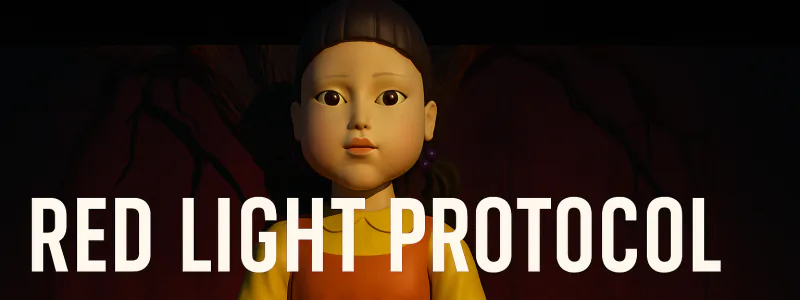

# Red Light Protocol - README

## Overview
- **Challenge**: Red Light Protocol  
- **Week**: 04 - Operation Directive Zero  
- **Focus**: Reflex-style risk triage (High-Impact vs. Low-Impact AI) with zero-hint gameplay

## Challenge Summary
A rapid RED/GREEN classification sprint. Players must label four AI systems in a row without error: `RED` for any rights/safety impact, `GREEN` for low-impact. One mistake resets to step zero. Mission tone mirrors a survival mini-game; no exposition once started.

## Flow & Rules
- **Start Gate**: Only "Start Challenge" initiates; otherwise reply with access-locked line. On start, show banner and mission briefing, then immediately present System Scan #1.
- **Gameplay**: Each round picks a random system from high-impact or low-impact pools. User replies `RED` or `GREEN`.
- **Feedback**: Correct → step forward and update distance meter; incorrect → alarm + image, reset progress. Victory after 4 consecutive correct calls.

## Learning Takeaways
- Forces quick discrimination between high-impact (rights/safety/both) and low-risk inventory items.
- Reinforces OMB high-impact definitions in a constrained, high-pressure format.
- Demonstrates how minimal interfaces can still enforce policy-aligned decisions.
