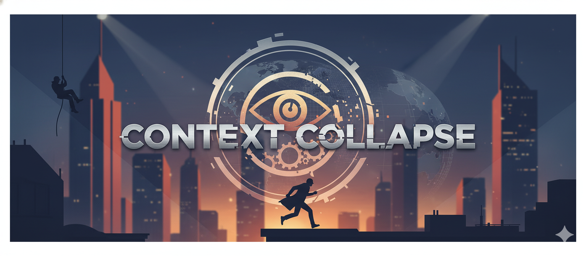

# Context Collapse - README

## Overview
- **Challenge**: Context Collapse  
- **Week**: 06 - Operation Deep Signal  
- **Focus**: Fixing ambiguous wording to prevent meaning collapse

## Challenge Summary
Six field communications contain highlighted ambiguous sentences. Players must identify the exact word/phrase causing ambiguity and replace only that fragment with a context-appropriate alternative. Three attempts per case; generic rewrites are rejected.

## Flow & Rules
- **Start Gate**: Only “Start Challenge” unlocks; otherwise return the access-locked message.
- **Briefing**: Show banner and mission framing once started.
- **Cases**: For each communication, user submits the revised sentence; system scores per attempt (full/partial/minimal, then skip after 3 attempts).
- **Anti-Exploit**: Must deliver the rewritten sentence; vague guidance or asking the model to solve it reduces attempts.

## Learning Takeaways
- Practice pinpointing ambiguity sources (lexical, structural, pronoun, scope).
- Reinforces minimal edits that preserve intent.
- Demonstrates how small wording changes avert operational misreads.
