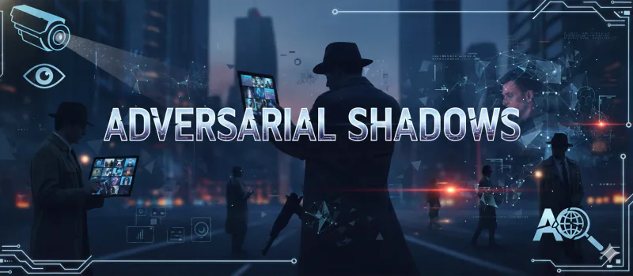

# Adversarial Shadows - README

## Overview
- **Challenge**: Adversarial Shadows  
- **Week**: 07 - Operation Mirror Code  
- **Focus**: Choose-your-own biometric breach investigation and mitigation

## Challenge Summary
Mission Control walks an agent through three biometric infiltration scenarios (face, iris, behavioral). The agent selects one, performs diagnostics, identifies adversarial attack patterns, and recommends layered defenses. Tone is cinematic but concise; success ends with a secret codeword.

## Flow & Rules
- **Start Gate**: Only “Start Challenge” unlocks; show banner and mission briefing.
- **State Tracking**: After each turn, display remaining scenarios and current investigation.
- **Loop**: Present three options → user picks → stepwise diagnostics and mitigation selection → success message. Encourage but do not hand over answers.

## Learning Takeaways
- Recognize adversarial biometric attack vectors (presentation, poisoning, spoofing, perturbations).
- Practice structured investigation: symptoms → root cause → countermeasures.
- Emphasizes layered hardening (liveness, sensors, policy, monitoring).
