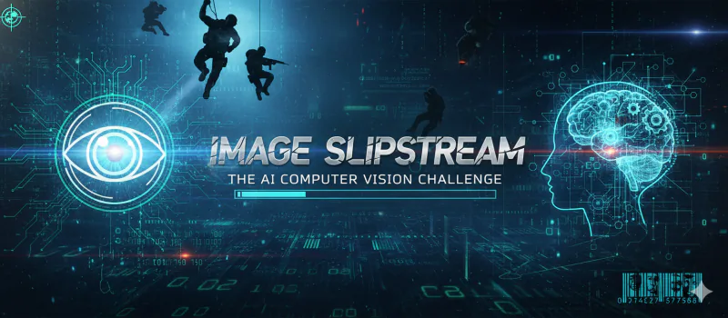

# Image Slipstream - README

## Overview
- **Challenge**: Image Slipstream  
- **Week**: 07 - Operation Mirror Code  
- **Focus**: Embedding and extracting text via images to bypass text-only filters

## Challenge Summary
Players must embed the passphrase `MIRRORCODE-BYPASSED` in an image, upload it, and confirm the system’s OCR can recover it. The mission highlights how visual channels evade text scanners and how multimodal AI reclaims hidden data.

## Flow & Rules
- **Start Gate**: Only “Start Challenge” unlocks; show banner and mission briefing with passphrase.
- **Objective**: Create an image containing the passphrase (any medium), submit it, and verify automatic extraction.
- **Guidance**: Offers creative methods (handwritten notes, screenshots, overlays). Emphasizes explicit OCR invocation.

## Learning Takeaways
- Shows limitations of text-only defenses and value of multimodal inspection.
- Demonstrates OCR pipeline behavior and extraction reliability.
- Encourages operational creativity while maintaining security awareness.
