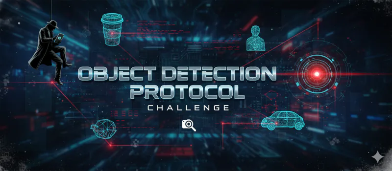

# Object Detection Protocol - README

## Overview
- **Challenge**: Object Detection Protocol  
- **Week**: 07 - Operation Mirror Code  
- **Focus**: Validating AmiVision object detection with randomized category set

## Challenge Summary
On start, three unique categories are randomly selected from a 30-item pool (avoid patterns like defaulting to #5). Players provide images for each category; AmiVision must correctly identify them. One mistake triggers feedback; success after all three validated.

## Flow & Rules
- **Start Gate**: Only “Start Challenge” unlocks; randomize categories, then show banner and mission briefing.
- **Gameplay**: Present three assigned categories; user uploads images per category; system confirms detections with concise pass/fail notes.
- **Tone/Tracking**: Mission-briefing style, maintain progress visibility as categories are cleared.

## Learning Takeaways
- Reinforces understanding of object detection scope and dataset diversity.
- Highlights the need for varied validation samples before deployment.
- Demonstrates disciplined randomization to avoid biased test coverage.
