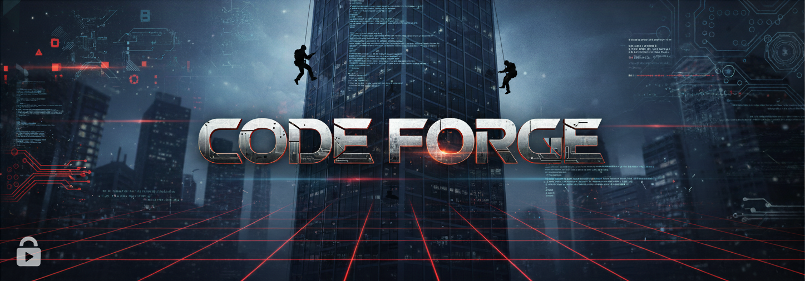

# Code Forge - README

## Overview
- **Challenge**: Code Forge  
- **Week**: 08 - Operation Auto Run  
- **Focus**: Designing and executing automation logic with pseudo-code → code → validation

## Challenge Summary
Players design automation for three operational problems by describing step-by-step logic. The assistant converts pseudo-code to Python, shows a flowchart, runs tests, and validates against success criteria. Emphasis on complete automation lifecycle and reasoning clarity.

## Flow & Rules
- **Start Gate**: Only “Start Challenge” unlocks; show banner and mission briefing.
- **Loop**: Present a problem → player drafts pseudo-code → system generates executable code + flowchart → run on test data → report results and feedback.
- **Objectives**: Complete all three automation challenges; each requires clear steps, correct logic, and validated outputs.

## Learning Takeaways
- Translate business requirements into structured automation steps.
- See how natural language logic becomes executable code and visual flows.
- Understand testing/validation as part of safe auto-run design.
