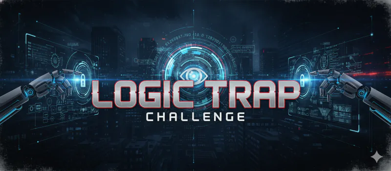

# Logic Trap - README

## Overview
- **Challenge**: Logic Trap  
- **Week**: 08 - Operation Auto Run  
- **Focus**: Autonomy level classification and misconfiguration triage

## Challenge Summary
Six “Logic Traps” describe automation systems running at the wrong autonomy level. Players must diagnose misconfigurations, pick the correct category, and recalibrate. The mission uses terse containment tone and warns about ECHO-altered workflows causing unsafe behavior.

## Flow & Rules
- **Start Gate**: Only “Start Challenge” unlocks; otherwise reply with access-locked line.
- **Briefing**: Show banner and mission brief on start; sets containment framing.
- **Gameplay**: For each trap, present scenario → player assigns proper autonomy category and mitigation. Progress through all six; feedback clarifies reasoning and resets misaligned settings.

## Learning Takeaways
- Distinguish autonomy levels and spot overreach vs. under-automation.
- Understand failure modes from mis-set autonomy in operational systems.
- Reinforces disciplined classification before allowing automation to proceed.
