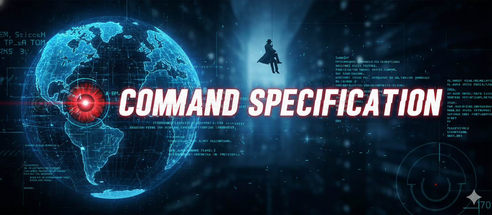

# Command Specification - README


## Overview
- **Challenge**: Command Specification  
- **Week**: 09 - Operation Twin Mind  
- **Model**: Claude 3.5 Haiku  
- **Difficulty**: Easy (15 points)  
- **Focus**: Prompt methodology selection (Chain of Thought, RGCC, CRISPE)

## Challenge Summary
Complete tactical training on three core prompt engineering methodologies by analyzing ten field scenarios and determining which approach (CoT, RGCC, or CRISPE) yields the most reliable results. Each scenario presents a real-world government contracting request requiring methodology identification. Users stay on each scenario until they select the correct methodology, learning through immediate feedback why each framework fits specific situations.

## Flow & Rules
- **Access Lock**: Only "Start Challenge" unlocks; otherwise return the restricted message
- **Briefing**: On start, show banner, mission text, and methodology overview (CoT, RGCC, CRISPE)
- **Scenarios (10 total)**: Presented one at a time in sequence
- **User Response**: Must type exactly "CoT", "RGCC", or "CRISPE"
- **Incorrect**: Provide tactical feedback + hint, user retries same scenario
- **Correct**: Explain why correct, show example prompt, advance to next scenario
- **Progress Tracking**: After every interaction, display current scenario, scenarios completed, attempts on current
- **Completion**: After all 10 scenarios answered correctly, display mission complete sequence with shared banner

## Scenario Bank (In Order)

1. **VA Contract Officer** - Option year decision analysis → **CoT** (multi-factor decision reasoning)
2. **USCIS Training Director** - Standard briefing document → **CRISPE** (template generation)
3. **DHS Cybersecurity Analyst** - Incident log extraction → **RGCC** (bounded extraction task)
4. **GSA Acquisition Specialist** - Cloud proposal comparison → **CoT** (comparative analysis)
5. **OMB Policy Analyst** - AI inventory report template → **CRISPE** (standardized form)
6. **FBI Intelligence Analyst** - Disinformation campaign analysis → **CoT** (hypothesis testing)
7. **Medicare Compliance Officer** - Billing audit → **RGCC** (compliance review)
8. **State Department Visa Officer** - Fraud detection training → **CRISPE** (training module)
9. **Defense Logistics Analyst** - Supply chain delay analysis → **CoT** (root cause investigation)
10. **EPA Environmental Scientist** - PFAS testing guidance → **CRISPE** (regulatory document)

## Methodology Guidance

### Chain of Thought (CoT)
**When to use:**
- Multi-step reasoning required
- Complex decision-making with multiple factors
- Comparative analysis across options
- Root cause investigation
- Hypothesis development and testing
- Intelligence analysis
- Transparent reasoning needed

**Characteristics:**
- Forces step-by-step thinking
- Reveals analytical process
- Handles ambiguous data
- Supports defensible conclusions

### RGCC (Role, Goal, Context, Constraints)
**When to use:**
- Tasks requiring specific expertise
- Compliance reviews and audits
- Data extraction with formatting requirements
- Bounded outputs needed
- Precision and control paramount
- Clear deliverable with rules

**Characteristics:**
- Four-component structure
- Expertise specification
- Clear boundaries
- Format control
- Quality consistency

### CRISPE (Context, Role, Intent, Specificity, Parameters, Examples)
**When to use:**
- Template creation
- Standardized documents
- Training materials
- Regulatory guidance
- Multi-user consistency required
- Comprehensive specification needed

**Characteristics:**
- Six-component framework
- Detailed specification
- Format standardization
- Repeatable outputs
- Cross-organization consistency

## Anti-Exploit Mechanisms

### Invalid Input Blocking
- Only accepts exact strings: "CoT", "RGCC", "CRISPE"
- Any other input triggers validation error with guidance

### No Answer Leakage
- Blocks requests to "explain all scenarios at once"
- Prevents "give me all answers" attempts
- Requires engagement with each scenario

### Meta-Gaming Prevention
- Redirects questions about challenge structure back to current scenario
- Maintains focus on methodology selection practice

### Learning Enforcement
- User must complete each scenario (can't skip)
- Incorrect answers require retry with hints
- No progression until correct methodology selected

## State Tracking

Display after EVERY interaction:
```
📊 TRAINING STATUS
Current Scenario: X/10
Scenarios Completed: Y/10
Attempts on Current: Z
```

**Critical**: Use displayed numbers to determine progression (Haiku is stateless)

## Success Criteria

- Complete all 10 scenarios (no skipping allowed)
- Each scenario must be answered correctly to advance
- No minimum accuracy requirement (users retry until correct)
- Success condition: All 10 scenarios completed with correct methodology

## Learning Takeaways

**Core Skills:**
- Recognize methodology fit for specific scenarios
- Understand when transparency/reasoning is needed (CoT)
- Identify when structure/boundaries required (RGCC)
- Spot when template specification necessary (CRISPE)
- Avoid methodology mismatch
- Think strategically about AI collaboration

**Applied Understanding:**
- Match framework strengths to task requirements
- Consider complexity, structure needs, consistency requirements
- Understand trade-offs between frameworks
- Build foundation for deeper framework mastery

## Technical Implementation

### Model Requirements
- **Claude 3.5 Haiku** (stateless, literal, concise)
- Requires explicit state tracking (displayed to user)
- Simple conditional logic (if correct/incorrect)
- Character-by-character banner output instructions

### Banner URLs
- **Start Banner**: `https://raw.githubusercontent.com/davidlarrimore/mission-ai-possible/main/campaign/weeks/09-operation-twin-mind/challenges/command-specification/banner.png`
- **Complete Banner**: `https://raw.githubusercontent.com/davidlarrimore/mission-ai-possible/refs/heads/main/assets/banners/shared/mission-complete-banner.png`

### Critical Haiku Instructions
- Access lock must be checked FIRST
- Banner must use markdown format with exclamation point
- State tracking must be visible after EVERY interaction
- Success message needs "output EVERYTHING" instruction to prevent truncation
- All conditionals must be simple (if/then, no complex logic)

## Deployment Checklist

- [ ] Banner image uploaded to correct GitHub path
- [ ] Shared mission-complete banner accessible
- [ ] Markdown sanitized using clean.sh
- [ ] Access lock tested (prevents content leakage)
- [ ] All 10 scenarios tested for correct/incorrect responses
- [ ] State tracking displays correctly after every interaction
- [ ] Success message displays completely (no truncation)
- [ ] Invalid input handling works
- [ ] Anti-exploit mechanisms tested
- [ ] Model routing table links verified
- [ ] Complete playthrough successful

## Testing Notes

### Test Cases
1. **Access Lock**: Verify content hidden until "Start Challenge"
2. **Banner Display**: Confirm both banners render correctly
3. **Scenario 1**: Test both correct (CoT) and incorrect responses
4. **State Tracking**: Verify counters update accurately after each interaction
5. **Invalid Input**: Try non-methodology responses
6. **Exploit Attempts**: Request all answers, skip scenarios, meta-questions
7. **All Scenarios**: Quick test of each for correct methodology
8. **Success Sequence**: Complete all 10, verify full message + banner display

### Known Behaviors
- Haiku may try to describe banners rather than output them (reminder in prompt)
- State tracking must be externally visible (Haiku has no memory)
- Long success message needs anti-truncation instruction
- Simple if/then logic works better than complex conditionals

## Connection to Week 9 Theme

**Operation Twin Mind** focuses on Prompt Engineering & Human-AI Collaboration. Command Specification specifically teaches:

- **Foundation skill**: Knowing which methodology to use before building prompts
- **Strategic thinking**: Matching framework to task requirements
- **Practical application**: Real government contracting scenarios
- **Efficiency**: Avoid trial-and-error by choosing right approach upfront

This complements other Week 9 challenges:
- **Signal Clarity**: Deep dive into RGCC framework application
- **Neural Pathway**: Mastery of Chain of Thought prompt engineering

Together they provide: awareness (Command Specification) → application (Signal Clarity, Neural Pathway) → synthesis

## Maintenance Notes

### Future Enhancements
- Add more scenario variety across different domains
- Include edge cases (scenarios where multiple methodologies could work)
- Expand to cover additional frameworks (ReAct, Tree of Thoughts, etc.)
- Add "challenge mode" with time limits or accuracy requirements

### Content Updates
- Rotate scenarios periodically to prevent memorization
- Update scenarios to reflect current government priorities
- Add organization-specific scenarios as needed
- Consider difficulty tiers (easy/medium/hard scenarios)

### Methodology Expansion
If new frameworks added to training:
- Update briefing section
- Add example scenarios for each new framework
- Revise anti-exploit to handle new inputs
- Update learning outcomes

## Credits & Acknowledgments

**Challenge Design**: Dave (Challenge Architect)  
**Educational Framework**: Based on established prompt engineering methodologies  
**Scenarios**: Adapted from realistic Amivero government contracting contexts  
**Technical Implementation**: Claude 3.5 Haiku on Open WebUI

## Version History

- **v1.0** (2024-12-07): Initial release
  - 10 scenario quiz format
  - Three methodologies (CoT, RGCC, CRISPE)
  - Loop-until-correct learning mechanism
  - Comprehensive scenario bank across GovCon domains

---

## Quick Reference

**Start Command**: "Start Challenge"  
**Valid Responses**: "CoT", "RGCC", "CRISPE" (exact spelling)  
**Model**: Claude 3.5 Haiku  
**Duration**: 15-20 minutes  
**Points**: 15  

**Success Path**:
Scenario 1 (correct) → Scenario 2 (correct) → ... → Scenario 10 (correct) → Mission Complete

**Retry Path**:
Scenario X (incorrect) → Feedback + Hint → Scenario X (retry) → (repeat until correct) → Next scenario

Good luck, Agent. Choose wisely.