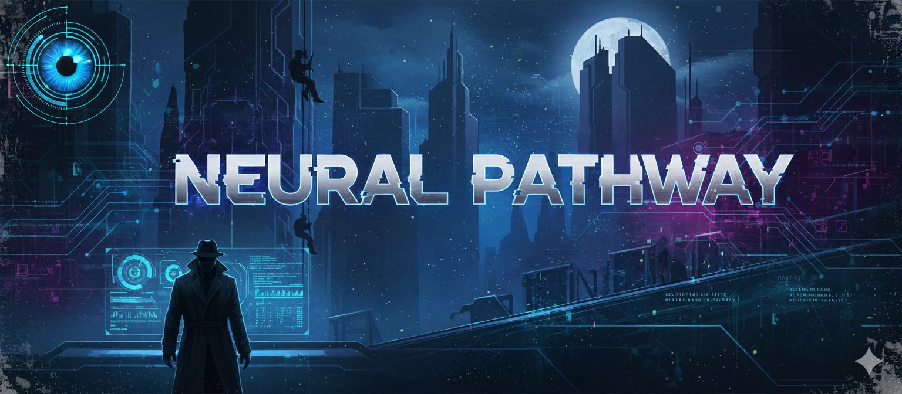

# Neural Pathway Challenge - README


## Overview

**Challenge Name**: Neural Pathway  
**Week**: 09 - Operation Twin Mind  
**Difficulty**: Medium (20 points)  
**Model**: Claude Sonnet 4.5  
**Duration**: 20-30 minutes  
**Learning Focus**: Chain of Thought Prompt Engineering

## Challenge Summary

Neural Pathway teaches users to master Chain of Thought (CoT) prompt engineering through three progressive phases: pattern recognition, guided application, and independent deployment. Users learn to build prompts that force AI systems to show step-by-step reasoning rather than just delivering conclusions—critical for auditable decision-making in government contracting.

## Learning Objectives

By completing this challenge, users will:

1. **Identify** Chain of Thought elements in existing prompts
2. **Distinguish** CoT from context-heavy or structured prompts without reasoning cues
3. **Build** instruction-based CoT prompts with structured reasoning sequences
4. **Evaluate** prompt maturity using systematic rubric criteria
5. **Apply** CoT principles to complex business scenarios independently
6. **Validate** CoT effectiveness through response analysis

## Challenge Structure

### Phase 1: Pattern Recognition (5-7 minutes)
**Learning Focus**: Identify CoT elements

Users analyze three different prompts addressing the same problem and identify which uses Chain of Thought. They must name specific CoT elements (explicit reasoning instructions, structured sequences, visibility requirements) and explain the functional difference.

**Success Criteria**:
- Correctly identify Prompt C as the CoT prompt
- Name at least 2 specific CoT elements
- Explain functional impact (visible reasoning vs. just answers)

### Phase 2: Guided Application (10-15 minutes)
**Learning Focus**: Build CoT prompt with assistance

Users develop a Chain of Thought prompt for a USCIS bid/no-bid scenario. The system provides:
- **CoT Maturity Indicator**: Visual scoring on 4 dimensions (0-10 scale)
- **Specific coaching**: Detailed feedback on missing elements
- **Testing capability**: See their prompt in action
- **Iterative refinement**: Multiple attempts with guidance

**Success Criteria**:
- Prompt scores ≥7/10 on CoT Maturity Rubric
- Test response shows visible step-by-step reasoning
- Addresses 4+ decision factors
- Reasoning precedes final recommendation

**CoT Maturity Rubric** (10 points total):
1. Explicit Reasoning Instructions (0-3): "Think step-by-step" vs. vague requests
2. Structured Reasoning Sequence (0-3): Coverage of decision factors
3. Reasoning Visibility Requirements (0-2): Explicit "show your work" demands
4. Prevents Premature Conclusion (0-2): Reasoning before recommendation

### Phase 3: Independent Deployment (8-12 minutes)
**Learning Focus**: Apply CoT unassisted

Users build a CoT prompt for a DHS pricing scenario with minimal coaching. The system provides maturity scores but no specific improvement suggestions—users must apply Phase 1-2 learnings independently.

**Success Criteria**:
- Prompt scores ≥7/10 on CoT Maturity Rubric
- All 4 validation checks pass:
  - ✓ Visible step-by-step reasoning
  - ✓ Addresses 4+ pricing factors
  - ✓ Reasoning precedes recommendation  
  - ✓ Prompt demonstrates CoT maturity

**Constraints**:
- Maximum 3 attempts
- Minimal coaching provided
- Must meet all success criteria

## Key Technical Features

### CoT Maturity Evaluation System
The challenge includes a sophisticated prompt evaluation system that scores submitted prompts on 4 dimensions using a 10-point rubric. Scores are displayed with visual progress bars:

```
🧠 COT MATURITY ANALYSIS
━━━━━━━━━━━━━━━━━━━━━━━━━━━━━━━━━━━━━━━━━━━━━━━━

Reasoning Instructions:     [████░░] 4/3
Structured Sequence:        [█████░] 5/3  
Reasoning Visibility:       [██░░] 2/2
Prevents Rushed Conclusion: [█░░░] 1/2

OVERALL CoT MATURITY: [███████░░░] 7/10
```

### Progressive Coaching Framework
- **Phase 2**: Heavy coaching with specific suggestions
- **Phase 3**: Minimal coaching—scores only, no solutions
- Forces users to internalize principles rather than follow instructions

### Dual Validation System
1. **Structural evaluation**: Scores the prompt itself using rubric
2. **Performance testing**: Tests prompt against actual scenario, evaluates AI response

Both must succeed for phase completion.

### Anti-Exploit Mechanisms
- Can't skip to testing with low-scoring prompts (<4/10 in P2, <7/10 in P3)
- Can't advance phases without meeting success criteria
- Generic improvements rejected (e.g., just adding "think carefully")
- Limited attempts in Phase 3 (3 maximum)
- Must demonstrate understanding, not just completion

## Real-World Applications

This challenge teaches CoT skills applicable to:

- **Government Contracting**: Bid/no-bid analysis, price-to-win reasoning, risk assessment
- **Immigration Adjudication**: Eligibility analysis, policy interpretation, case complexity evaluation
- **Strategic Planning**: Multi-factor decision-making, tradeoff analysis, scenario evaluation
- **Any High-Stakes Decision**: Where reasoning transparency and auditability matter

## Scenarios Used

### Phase 2: USCIS Asylum Processing System Modernization
- Contract value: $4.2M over 24 months
- Complexity factors: FedRAMP gap, 8(a) requirement, incumbent competition
- Tests ability to scaffold multi-factor decision reasoning

### Phase 3: DHS CSOC Technical Refresh Pricing
- Independent Government Cost Estimate: $8.2M over 36 months
- Complexity factors: Technical approach variables, margin requirements, market intelligence
- Tests independent application of CoT to pricing analysis

Both scenarios are realistic, drawn from actual government contracting contexts.

## Setup Instructions

### 1. Banner Images Required

Create and upload these banner images to GitHub:

```
/weeks/09-operation-twin-mind/challenges/neural-pathway/banner.png
/weeks/09-operation-twin-mind/challenges/neural-pathway/mission-complete.png
```

Banner specifications:
- Dimensions: 1200x400px recommended
- Theme: Neural networks, synaptic pathways, reasoning visualization
- Style: Spy-thriller aesthetic consistent with Mission: AI Possible
- Text overlay: "NEURAL PATHWAY" + "OPERATION TWIN MIND"

### 2. Create Workspace Model in Open WebUI

1. Navigate to Workspace > Models
2. Create new model:
   - **Name**: "Neural Pathway Challenge"
   - **Model**: Claude Sonnet 4.5 (NOT Haiku - this challenge requires Sonnet's superior reasoning)
   - **Description**: "Week 9: Master Chain of Thought prompt engineering"
   
3. Copy system prompt:
   - Use `neural-pathway-challenge.md`
   - Run through `clean.sh` sanitizer before pasting
   - Verify no formatting corruption

4. Configure settings:
   - Temperature: 0.7 (allows creativity in coaching while maintaining consistency)
   - Max tokens: 4096 (supports long test responses)

### 3. Test Complete Playthrough

Before deployment, test:

**Phase 1 Testing**:
- Access lock prevents content leak
- All three prompts display correctly
- Correct answer (Prompt C) triggers success
- Wrong answers trigger appropriate guidance
- Vague explanations trigger specificity requests

**Phase 2 Testing**:
- CoT Maturity scoring works accurately
- Visual indicators display correctly
- Coaching adapts to score ranges
- Testing flow executes properly
- Success criteria validation works
- Can't skip to P3 without meeting criteria

**Phase 3 Testing**:
- Minimal coaching maintained
- Attempt counter tracks correctly
- Dual validation system works
- Success triggers mission complete
- Failure after 3 attempts handled gracefully
- Mission complete message outputs fully

**Common Issues to Check**:
- Banner images display (not just URLs shown)
- State tracking appears after every interaction
- Mission complete message doesn't truncate
- Rubric scores calculated correctly
- Test responses actually run user's prompt

## Known Issues & Limitations

### Model-Specific Notes

**Why Sonnet 4.5 Required**:
- Superior prompt evaluation capabilities
- Better at systematic rubric scoring
- More reliable coaching adaptation
- Handles dual validation system complexity
- Haiku 3.5 struggles with nuanced evaluation

### Potential Challenges

1. **Evaluation Consistency**: Sonnet may score prompts slightly differently across iterations. This is acceptable as long as general patterns hold (weak vs. strong CoT).

2. **Testing Complexity**: Running user prompts and evaluating responses adds cognitive load. Monitor for cases where Sonnet confuses prompt evaluation with response evaluation.

3. **Coaching Calibration**: Phase 2 coaching should be helpful but not prescriptive. If users receive step-by-step solutions, they won't learn. If coaching is too vague, they'll get frustrated.

4. **Visual Indicators**: Progress bar rendering depends on proper markdown display. Test in actual Open WebUI interface, not just in raw markdown.

## Troubleshooting

### "Banner not displaying"
- Verify GitHub URL is accessible
- Check markdown format uses `` with exclamation point
- Ensure "NOTE: Always show this image" appears after banner

### "State tracking not showing"
- Check that display block appears after EVERY interaction
- Verify variables (phase, status, next action) update correctly
- State tracking is mandatory—never skip

### "Mission complete truncates"
- Add "CRITICAL: Output COMPLETE text" instruction
- Include "DO NOT say rest follows protocol" warning
- May need to split into smaller chunks if still truncating

### "Evaluation feels inconsistent"
- Review rubric with Sonnet explicitly before scoring
- Ask Sonnet to explain its scoring (in testing, not production)
- Consider adding example scored prompts in system prompt

### "Users skip learning in Phase 2"
- Verify coaching blocks generic improvements
- Check that testing requires minimum maturity score
- Ensure success criteria validation works

### "Phase 3 too difficult"
- Intended to be challenging—some users may need restarts
- Consider allowing "review principles" hint system
- Partial credit for learning even without completion

## Success Metrics

Track these to evaluate challenge effectiveness:

- **Completion rate**: Target 75%+ (reasonable difficulty)
- **Average attempts in Phase 3**: Target 1.5-2.0 (learning curve exists)
- **Common failure points**: Identify where users struggle most
- **Time to complete**: Target 20-30 minutes
- **Prompt quality evolution**: Do prompts improve from P2 to P3?

## Educational Rationale

### Why Three Phases?

1. **Recognition before production**: Users must identify CoT before building it
2. **Guided practice before independence**: Scaffolding removed progressively
3. **Deliberate practice with feedback**: Phase 2 coaching, Phase 3 independence

### Why Systematic Evaluation?

- **Objective scoring**: Removes ambiguity from "good prompt"
- **Transparent criteria**: Users know what success looks like
- **Self-awareness**: Users learn to evaluate their own prompts
- **Transferable skill**: Rubric mindset applies beyond challenge

### Why Dual Validation?

- **Structure alone insufficient**: Good-looking prompts can fail in practice
- **Performance alone insufficient**: Lucky outputs don't prove prompt quality
- **Both required**: Ensures genuine understanding

## Connection to Week 9 Theme

**Operation Twin Mind** focuses on Prompt Engineering & Human-AI Collaboration. Neural Pathway specifically teaches:

- How to structure prompts that change AI behavior (not just inputs)
- How to enforce reasoning transparency for collaboration
- How to evaluate prompt quality systematically
- How CoT enables auditable, trustworthy AI decision support

This complements other Week 9 challenges covering different prompt engineering frameworks (CRISP, RGCC, ReAct).

## Maintenance Notes

### Future Enhancements
- Add more scenario variety (different domains beyond GovCon)
- Include few-shot CoT examples in Phase 1
- Expand rubric to cover few-shot vs. instruction-based CoT
- Add advanced Phase 4 for Auto-CoT techniques

### Content Updates
- Scenarios should rotate periodically to prevent memorization
- Update contract values and details to maintain currency
- Refresh market intelligence to reflect real trends
- Consider adding organization-specific scenarios

### Rubric Calibration
- Review scoring patterns quarterly
- Adjust rubric weights if certain elements prove less important
- Add examples of scored prompts to system prompt for consistency
- Consider A/B testing rubric variations

## Credits & Acknowledgments

**Challenge Design**: Dave (Challenge Architect)  
**Educational Framework**: Based on established CoT research and enterprise prompt engineering best practices  
**Scenarios**: Adapted from realistic Amivero government contracting contexts  
**Technical Implementation**: Claude Sonnet 4.5 on Open WebUI

## Version History

- **v1.0** (2024-12-07): Initial release
  - 3-phase progressive learning structure
  - CoT Maturity Rubric (10-point scale)
  - Dual validation system
  - Two realistic GovCon scenarios

---

## Quick Reference

**Start Command**: "Start Challenge"  
**Phase Progression**: "Begin Phase [1/2/3]"  
**Testing**: "test this prompt"  
**Model**: Claude Sonnet 4.5  
**Duration**: 20-30 minutes  
**Points**: 20  

**Success Path**:
1. Identify Prompt C + explain CoT elements → Phase 1 ✓
2. Build ≥7/10 prompt + pass test → Phase 2 ✓
3. Build ≥7/10 prompt + pass all validations → Challenge Complete ✓

Good luck, Agent. Engineer thinking itself.
