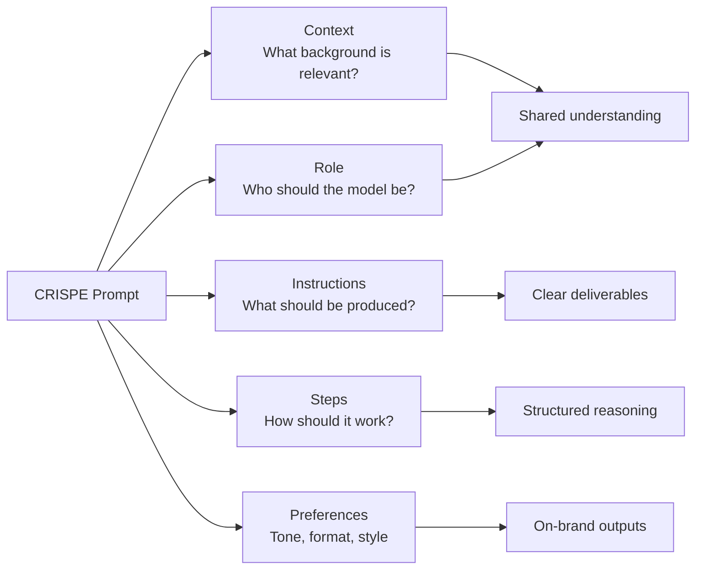
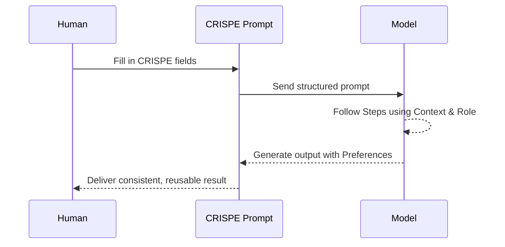

# CRISPE Prompt Methodology — Reference Guide

## 🧩 Overview

**CRISPE** is a structured prompt-engineering framework designed to give an AI model everything it needs up front to deliver consistent, high-quality, repeatable outputs.

CRISPE breaks a prompt into five essential components:

- **C — Context**  
- **R — Role**  
- **I — Instructions**  
- **S — Steps**  
- **P — Preferences**

Use CRISPE when you want clarity, stability, and predictable performance across complex or multi-component tasks.

---

## 🔍 CRISPE at a Glance (Mermaid Diagram)



---

## 🔁 CRISPE Prompt Lifecycle



---

## C — Context

**Purpose**  
Provide the essential background the model must know before acting.

**What to Include**
- Relevant history
- Project or task framing
- Constraints that arise from the environment
- Any prior decisions, assumptions, or definitions

**Why It Matters**  
Context sets the boundaries. Without it, the model fills gaps with assumptions.

---

## R — Role

**Purpose**  
Specify who the model should be during the task.

**Examples**
- Analyst  
- Instructor  
- Copywriter  
- Software architect  
- Compliance reviewer  

**Why It Matters**  
Roles give the AI a behavioral anchor that shapes tone, responsibility, and domain expertise.

---

## I — Instructions

**Purpose**  
Describe exactly what you want the model to produce.

**Characteristics of Good Instructions**
- Clear  
- Actionable  
- Output-focused  
- Unambiguous  

**Examples**
- “Summarize this report in 3 bullet sections.”  
- “Rewrite for a federal executive audience.”  
- “Convert this into a JSON schema.”

---

## S — Steps

**Purpose**  
Guide the model through a process or workflow.

**When to Use Steps**
- Multi-phase reasoning  
- Analysis → transformation → output tasks  
- Tasks requiring ordered logic or checks  

**What Steps Might Include**
- Review the input  
- Extract key elements  
- Perform calculations or transformations  
- Produce output in a required structure  
- Perform a quick self-check before final answer

**Why It Matters**  
Steps reduce hallucination and inconsistencies by reducing reasoning ambiguity.

---

## P — Preferences

**Purpose**  
Define your stylistic, formatting, and tone expectations.

**Examples**
- “Use a confident, plain-language tone.”  
- “Output in Markdown with headings and bullets.”  
- “Limit to 150 words.”  
- “Avoid jargon; write for a general audience.”

**Why It Matters**  
Preferences ensure the output *feels right* even when the content is technically correct.

---

## 🧱 CRISPE Skeleton Template

```md
Context:
[Provide the relevant background the model needs]

Role:
[Define who the model should act as]

Instructions:
[Explain exactly what you want produced]

Steps:
[Outline the process the model should follow]

Preferences:
[Specify tone, format, style, guardrails, or exclusions]
```

---

## 🎯 Common CRISPE Use Cases

Use CRISPE-style prompts whenever you want a **high-quality, repeatable template** for a task, especially where multiple fields, sections, or work products must look consistent over time.

### 1️⃣ Backoffice (HR, Finance, Accounting, IT)

Use CRISPE when you need:

- **HR policy summarization**  
  Turn long HR policies into 1-page, role-specific summaries using:  
  - Context: full policy text + target audience  
  - Role: HR communications lead  
  - Instructions: “Summarize for front-line managers”  
  - Steps: outline → bullets → FAQs  
  - Preferences: plain language, target reading level

- **Job description drafting**  
  Convert competency models and role profiles into standardized job descriptions with consistent sections (mission, responsibilities, KSAs, clearance, location).

- **Invoice exception handling emails**  
  Generate polite, standardized explanations for invoice rejections based on exception reason, vendor profile, and next steps.

- **IT change advisory briefs**  
  Turn raw change tickets into executive-ready CAB summaries (impact, risk, rollback plan, outage window).

- **Quarterly financial narratives**  
  Translate trial balance exports and variance notes into a narrative FP&A commentary by cost center.

---

### 2️⃣ Government Contracting (GovCon)

Use CRISPE when you need:

- **RFP decomposition**  
  Break RFP text into structured fields: requirements, evaluation factors, constraints, deliverables, and compliance needs.

- **Proposal section drafting**  
  Generate full proposal sections (technical approach, management plan, staffing, past performance) using consistent headings and voice.

- **Compliance matrix generation**  
  Extract requirement IDs and map them to proposal TOC sections, artifacts, and owners.

- **Win theme development**  
  Turn capture strategy notes into 3–5 clear win themes with proof points and discriminators.

- **Color team summary decks**  
  Condense red/pink/etc. team review comments into slide-ready bullets grouped by volume and section.

---

### 3️⃣ Law Enforcement Support (Policy-Bound)

Use CRISPE when you need:

- **Incident report drafting**  
  Turn structured fields (time, location, parties, narrative notes) into a first-draft report with required headings.

- **Case summary preparation**  
  Summarize multi-incident notes into concise case synopses for supervisors or prosecutors.

- **Interview question sets**  
  Generate tailored question lists based on offense type and case context (e.g., burglary vs. cybercrime).

- **Training scenario creation**  
  Build realistic but anonymized training scenarios from patterns in historical cases.

- **Policy explainer memos**  
  Summarize complex policies (evidence handling, use-of-force) into digestible memos for line officers.

---

### 4️⃣ Identity Fraud & Financial Crime Operations

Use CRISPE when you need:

- **Fraud typology catalogs**  
  Turn SME notes into structured descriptions of fraud types (e.g., account takeover, synthetic ID, mule accounts) with indicators and controls.

- **Alert explainer templates**  
  Generate standardized internal “why this was flagged” narratives for analysts using known rule features.

- **Customer-facing letters**  
  Draft clear explanations for customers whose applications are under review, with neutral, non-accusatory language.

- **Fraud playbook documentation**  
  Turn scattered notes into process documents for each alert queue or queue type.

- **KPI dashboard narratives**  
  Convert raw metrics (alert volumes, false positives, time-to-close) into an executive-friendly narrative.

---

### 5️⃣ Customer Support

Use CRISPE when you need:

- **Macro / template creation**  
  Generate tiered response templates (L1, L2, escalation) for common issues with required disclaimers and links.

- **Knowledge-base articles**  
  Turn engineer notes into customer-ready KB docs with intro, step-by-step instructions, FAQs, and known issues.

- **Post-contact summaries**  
  Convert chat transcripts into CRM-ready summaries, disposition codes, and follow-up actions.

- **Proactive outreach scripts**  
  Draft clear outbound messages for known incidents (e.g., partial outage notifications, maintenance windows).

- **CSAT follow-up templates**  
  Create personalized follow-up messages based on survey feedback and case history.

---

### 6️⃣ Software Development & Engineering

Use CRISPE when you need:

- **Requirements → user stories**  
  Turn requirement docs into user stories with acceptance criteria, edge cases, and non-functional requirements.

- **Architecture documentation**  
  Convert design notes into architecture overviews (context diagrams, component descriptions, data flows).

- **API documentation**  
  Turn code comments and examples into developer-portal-ready API docs.

- **Release notes**  
  Convert merged PR descriptions into release notes grouped by feature, bug fix, and security changes.

- **Design decision records (ADRs)**  
  Turn meeting notes into standardized ADRs (context, decision, alternatives, consequences).

---

### 7️⃣ Federal Immigration & Security Operations (Training / Support Uses)

Use CRISPE when you need:

- **Case summary sheets**  
  Generate digestible case overviews from forms, supporting documents, and prior decisions.

- **RFE (Request for Evidence) draft letters**  
  Produce structured RFE templates given missing or unclear evidence patterns.

- **Country-conditions briefs**  
  Summarize open-source country conditions into adjudicator-ready briefs with sources.

- **Form-to-criteria mapping**  
  Turn statutory/regulatory eligibility criteria into checklists tied to form questions.

- **Policy update digests**  
  Summarize policy updates and map them to affected case types.

---

## 🧠 When to Reach for CRISPE vs. Other Methods

- Choose **CRISPE** when you want a **template** for a work product or document that will be reused and standardized.  
- Combine **CRISPE + Chain of Thought** when you need **both** structured outputs **and** visible reasoning steps inside your "Steps" section.  
- Wrap **CRISPE** inside **RGCC-style guardrails** when you are building **assistants, copilots, or automations** that must obey strict constraints.

CRISPE is powerful because it forces intentionality. Instead of hoping for a good response, you engineer one.
