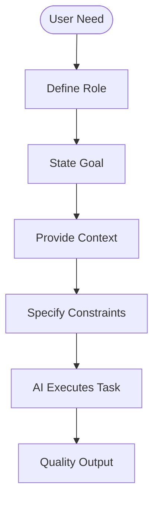
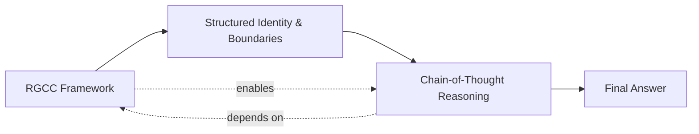
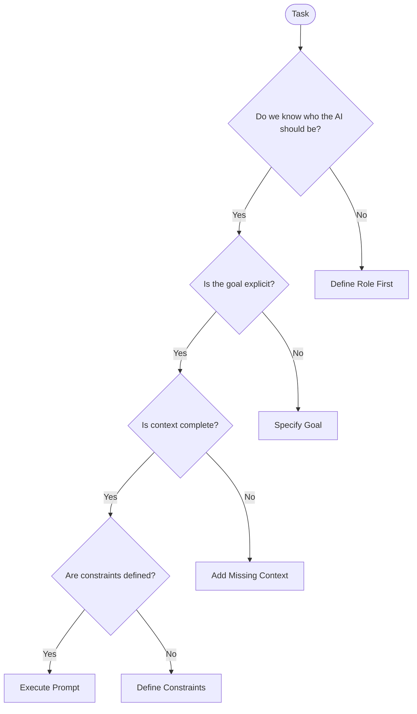
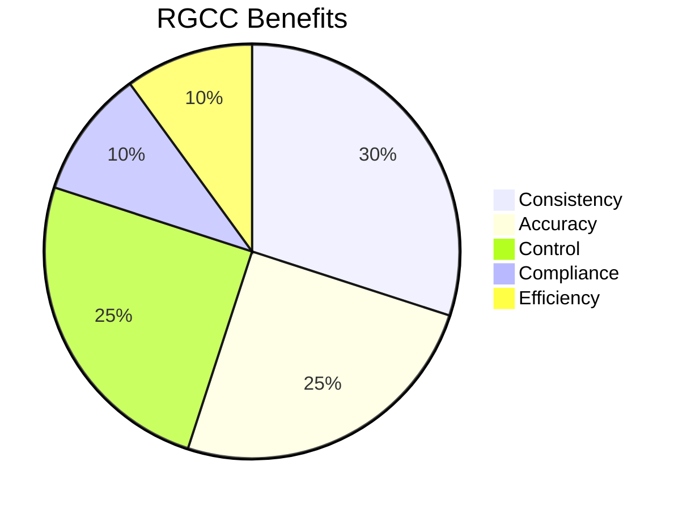

# 🧩 RGCC Prompt Methodology — Master Reference Guide  
### *Mission: AI Possible – Signal Clarity Challenge Edition*  
**Version:** 1.0  
**Last Updated:** February 2025  

---

# 🧠 What Is the RGCC Prompt Framework?

**RGCC** stands for:

> **Role + Goal + Context + Constraints**

It is one of the most reliable and transferable prompt-engineering structures for producing **predictable, high-quality, policy-aligned AI responses**.  

While Chain-of-Thought tells the AI *how to think*, **RGCC tells the AI *who to be*, *what to do*, *what information matters*, and *what boundaries apply*.**

Together, RGCC + CoT = **elite-grade reasoning control.**

---

# 🎯 Why RGCC Works  
When prompting an AI, ambiguity is the enemy. RGCC eliminates this by:

- **Reducing hallucination** through explicit structure  
- **Improving consistency** across teams  
- **Clarifying intent** for complex tasks  
- **Controlling tone, persona & methodology**  
- **Aligning output to compliance frameworks**  
- **Ensuring repeatability** for enterprise workflows  

RGCC is used heavily in:

- Government workflows  
- Intelligence & adjudication tasks  
- Engineering analysis  
- GovCon capture and proposal development  
- Support, coaching, and customer-facing systems  
- Instructional design and report generation  

---

# 🧱 The Four Pillars of RGCC

## 1️⃣ **Role** — Who the AI Should Be  
The role defines the *persona*, *capabilities*, and *methodology* the model adopts.

**Examples:**  
- “Act as a senior solutions engineer specializing in cloud modernization.”  
- “You are an OMB Circular A-11 compliance analyst.”  
- “Play the role of a calm, structured tutor for a new developer.”  

**Effects:**  
- Narrows the model’s behavior  
- Reduces irrelevant creativity  
- Improves domain accuracy  

---

## 2️⃣ **Goal** — What the AI Should Accomplish  
This is the **explicit mission objective**.

**Examples:**  
- “Your goal is to create a bid/no-bid analysis.”  
- “Your goal is to explain the FAR implications.”  
- “Your goal is to diagnose the root cause.”  

**Effects:**  
- Minimizes meandering responses  
- Anchors task completion  
- Helps the model prioritize signal over noise  

---

## 3️⃣ **Context** — What Inputs or Information Matter  
Context includes **data**, **background**, **examples**, and **conditions** relevant to the task.

**Examples:**  
- “Here is the solicitation text…”  
- “Include the client’s stated pain points…”  
- “Given the following policy excerpts…”  

**Effects:**  
- Increases accuracy  
- Reduces hallucination  
- Ensures alignment to real-world inputs  

---

## 4️⃣ **Constraints** — What Rules Must Be Followed  
Constraints define the **boundaries** and **output format**.

**Examples:**  
- “Respond in markdown.”  
- “No more than 200 words.”  
- “Do not reference internal model behavior.”  
- “Cite FAR clauses where applicable.”  

**Effects:**  
- Ensures compliance  
- Produces predictable structure  
- Supports human and machine readability  

---

# 🧠 RGCC System Diagram (High-Level Workflow)



This shows the **input architecture AI relies on** before generating reasoning or responses.

---

# 🔮 RGCC + CoT Pipeline (How They Work Together)



**Interpretation:**  
- RGCC defines the **container**.  
- CoT defines the **thinking inside the container**.

---

# 🧰 RGCC Prompt Templates (Copy/Paste Ready)

## Template 1 — Core RGCC
```
Role: You are a [role/persona].
Goal: Your goal is to [desired outcome].
Context: Here is the information you need: [insert context].
Constraints: Follow these rules: [format, length, tone, compliance].

Now perform the task.
```

---

## Template 2 — RGCC + CoT (Recommended for analysis)
```
Role: Act as a [specialist].
Goal: Your goal is to [complete task].
Context: Use the following information: [insert].
Constraints: Follow these rules: [formatting, citations, tone].

Think step-by-step (Chain-of-Thought), and only after reasoning,
provide the final answer.
```

---

## Template 3 — RGCC for Decision Support  
```
Role: You are a senior advisor.
Goal: Evaluate the following decision.
Context: [Decision details, data].
Constraints: Present analysis with:
- pros and cons
- risks
- recommendation
- markdown format
```

---

## Template 4 — RGCC for Real-World Task Simulation  
```
Role: You are simulating a real-world workflow: [describe].
Goal: Provide an accurate, compliant output for this scenario.
Context: [Inputs, policies, requirements].
Constraints: Follow regulations, no assumptions without stating uncertainty.
```

---

# 🧱 Anatomy of a Strong RGCC Prompt

| Component | Strong Example | Weak Example |
|-----------|----------------|--------------|
| **Role** | “You are a FAR policy expert with adjudication experience.” | “You are ChatGPT.” |
| **Goal** | “Your goal is to produce a defensible analysis.” | “Help me with this.” |
| **Context** | “Here are the client's priorities and constraints…” | “You know what I mean.” |
| **Constraints** | “Max 300 words, markdown, cite regulations.” | “Just explain.” |

---

# 🧬 RGCC Use Cases

### GovCon & Capture  
- Bid/no-bid recommendation  
- Section L/M decomposition  
- Strengths/weaknesses mapping  
- Technical volume drafting  

### Government & Policy  
- FAR/DFARS interpretation  
- Case analysis  
- Risk assessment  
- OMB policy breakdown  

### Engineering  
- Code review  
- Architecture analysis  
- System decomposition  
- Process design  

### Education & Training  
- Tutor personas  
- Guided learning modules  
- Socratic step-by-step reasoning  

### Customer-Facing Uses  
- Support agent simulation  
- Intake form reasoning  
- Knowledgebase answer generation  

---

# 🧠 RGCC Conceptual Diagram (Mental Model)



This model demonstrates how **incomplete prompts fail** and how RGCC fills the gaps.

---

# 📉 RGCC Anti-Patterns (Common Pitfalls)

❌ Missing or vague role  
❌ Goal stated as a question instead of an objective  
❌ Too much or irrelevant context  
❌ No output constraints → model rambles  
❌ Role contradicts the task  
❌ Context conflicts with constraints  

---

# 🔍 How to Evaluate RGCC Prompt Quality

Ask:

- Does the AI know *who it is*?  
- Does it know *the mission*?  
- Is the context *sufficient and relevant*?  
- Are constraints *clear and enforceable*?  
- Can two different people reuse the prompt and get consistency?  

If yes → **High-quality RGCC**.

---

# 📊 RGCC Benefit Profile



---

# 🧪 RGCC Checklist (Use Before Sending a Prompt)

- [ ] Did you assign a clear role?  
- [ ] Is the goal framed as an objective?  
- [ ] Did you provide needed context?  
- [ ] Are constraints explicit and tight enough?  
- [ ] Should you layer Chain-of-Thought on top?  

If all five are checked → **excellent signal clarity**.

---

# 🌟 Why RGCC Matters in Mission: AI Possible

This framework trains you and your team to:

- Craft **repeatable**, **policy-aligned**, **high-signal prompts**  
- Reduce ambiguity and hallucination  
- Scale AI behaviors across enterprise tasks  
- Improve reasoning outcomes when paired with CoT  
- Build prompts that *anyone* can use reliably  

**RGCC is the foundation.  
CoT is the accelerator.  
Together, they unlock elite AI performance.**

---

**End of RGCC Reference Guide – Version 1.0**  
Mission: AI Possible • Week 09 • Operation Twin Mind
