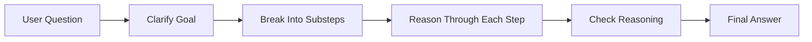
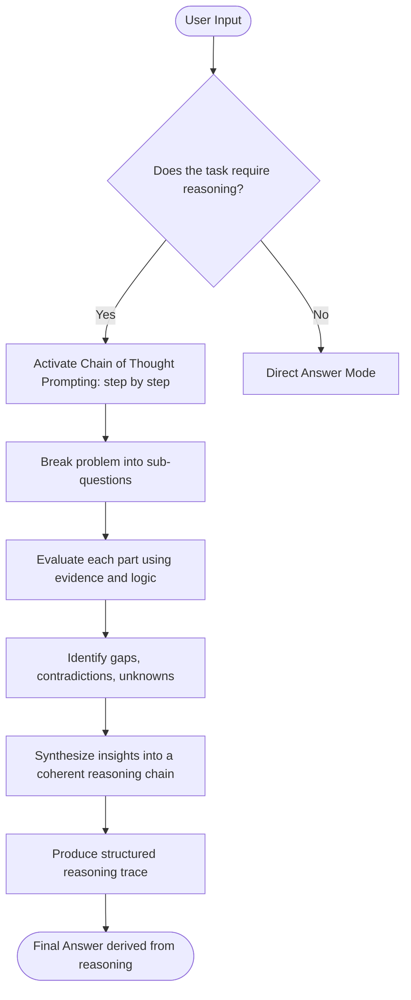
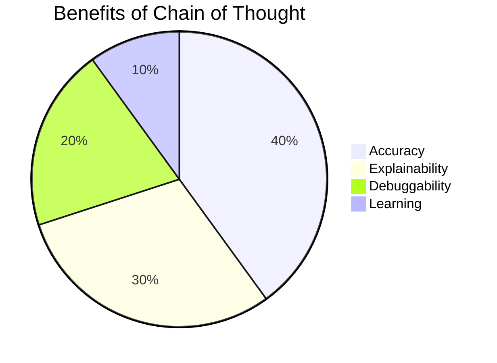

# 🧠 Chain-of-Thought (Chain of Thought) Master Reference Guide  
### *Mission: AI Possible – Neural Pathway Challenge Edition*  
**Version:** 2.0  
**Last Updated:** December 2024  

---

# 🚀 What Is Chain-of-Thought (Chain of Thought)?

**Chain-of-Thought (Chain of Thought)** is a prompt engineering technique that instructs an AI system to **show its reasoning step-by-step**, producing *auditable, transparent, structured thinking* before giving a final answer.

> Without Chain of Thought:  
> “Yes, bid on this.” *(No explanation.)*  
>  
> With Chain of Thought:  
> “1. Assess fit → 2. Analyze risks → 3. Compare competition → 4. Recommend based on reasoning.”

Chain of Thought transforms an AI from a *black box answer machine* into a **reasoning partner**.

---

# 🎯 Why Chain of Thought Matters  
Across every mission set—GovCon, immigration, fraud detection, adjudication, engineering workflows—Chain of Thought brings:

- **Auditability** — reasoning chains you can inspect  
- **Error detection** — flawed steps become visible  
- **Transparency** — stakeholders see *how* the answer was formed  
- **Compliance** — supports defensible, policy-aligned decisions  
- **Learning** — users learn reasoning patterns  

---

# 🧩 Visual: The Chain of Thought Reasoning Pipeline


```mermaid
flowchart LR
    A[User Question] --> B[Clarify Goal]
    B --> C[Break Into Substeps]
    C --> D[Reason Through Each Step]
    D --> E[Check Reasoning]
    E --> F[Final Answer]
```

---

# 🔮 Chain of Thought Conceptual Flow Diagram (High‑Level Mental Model)


```mermaid
flowchart TB
    A([User Input]) --> B{Does the task require reasoning?}
    B -- Yes --> C[Activate Chain of Thought Prompting: step by step]
    B -- No --> Z[Direct Answer Mode]

    C --> D[Break problem into sub-questions]
    D --> E[Evaluate each part using evidence and logic]
    E --> F[Identify gaps, contradictions, unknowns]
    F --> G[Synthesize insights into a coherent reasoning chain]
    G --> H[Produce structured reasoning trace]

    H --> I([Final Answer derived from reasoning])
```

This diagram illustrates **how an AI internally organizes thinking** once Chain‑of‑Thought prompting is activated:
- Does the task *need* reasoning?  
- If yes → break down → analyze → synthesize → produce structured reasoning → answer.  
- If no → respond directly.

---

# 🆚 Traditional Prompting vs Chain of Thought Prompting

| Style | Example | Result |
|-------|---------|--------|
| **Traditional Prompting** | “Should we bid on this contract?” | “Yes, you should bid.” (*No logic shown*) |
| **Structured Chain of Thought Prompting** | “Think step-by-step: 1) capability fit, 2) risks, 3) competition, 4) strategic value…” | A full reasoning chain followed by a recommendation |

---

# 🧠 When to Use Chain of Thought (and When *Not* To)

## ✔️ Use Chain of Thought for:
- Multi-factor decisions (bid/no-bid, pricing, staffing, risk decisions)  
- Complex analysis (root cause, policy interpretation, case evaluation)  
- High-stakes scenarios (compliance, adjudication, fraud detection)  
- Planning and strategy (roadmaps, tradeoff analysis)  
- Teaching and instruction (explain logic; show work)

## ⚠️ Avoid excessive Chain of Thought for:
- Simple factual questions  
- Highly constrained output formats (strict JSON)  
- Creative writing where reasoning isn't required  

**Rule of Thumb:**  
If a human expert would show their work → use Chain of Thought.

---

# 🧱 Elements of a Strong Chain of Thought Prompt

## 1️⃣ Explicit Reasoning Instructions  
**Weak:** "Analyze this."  
**Strong:**  
- “Think step-by-step and explain your reasoning.”  
- “Walk through this systematically before concluding.”

**Common cues:**  
- “Show your work.”  
- “Explain the logic behind each step.”  
- “Don’t jump to conclusions.”

---

## 2️⃣ Structured Sequence  
Give the model **explicit steps** to follow.

**Example:**  
```
Reason through this decision:

1. Capability fit
2. Resource impact
3. Competitive landscape
4. Strategic value
5. Recommendation
```

---

## 3️⃣ Reasoning Visibility (Show Your Work)  
Behaviors we want:  
- Numbered reasoning  
- Tradeoff evaluation  
- Calling out uncertainty  
- Explicit comparisons  

**Visibility Cues:**  
- “Lay out the tradeoffs.”  
- “Explain the logic behind each factor.”  

---

## 4️⃣ Prevent Premature Conclusions  
Tell the model *when* to give the answer.

**Examples:**  
- “After analyzing X, Y, and Z… provide your recommendation.”  
- “Do not give a conclusion until the step-by-step reasoning is complete.”

---

# 🔢 Chain of Thought Maturity Levels

| Level | Description | Example |
|-------|-------------|---------|
| **1 — No Chain of Thought** | Jump straight to recommendation | “Yes, bid.” |
| **2 — Implicit Chain of Thought** | Some analysis but unclear structure | “It seems like a good idea because…” |
| **3 — Structured Chain of Thought** | Clear steps + reasoning | Numbered steps with full logic |
| **4 — Advanced Chain of Thought** | Steps + reasoning + checks + avoids early conclusions | Highly auditable, deliberate reasoning |

---

# 📝 Chain of Thought Prompt Templates (Copy/Paste Ready)

## Template 1 — Basic Instruction Chain of Thought
```
[Context]

Think step-by-step and show your reasoning. After completing your analysis, 
provide your final answer.
```

## Template 2 — Structured Decision Chain of Thought  
```
[Problem]

Reason through this systematically:

1. [Factor 1]
2. [Factor 2]
3. [Factor 3]
4. [Synthesis]

Explain your reasoning before concluding.
```

## Template 3 — Comparative Chain of Thought  
```
Compare these options:

Option A:
Option B:
Option C:

For each option, evaluate:
- [Criterion 1]
- [Criterion 2]
- [Criterion 3]

Then compare them step-by-step and recommend.
```

## Template 4 — Risk Assessment Chain of Thought  
```
[Scenario]

Walk through this step-by-step:

1. Identify risks
2. Assess likelihood & impact
3. Evaluate mitigations
4. Recommend based on analysis

Show reasoning before final answer.
```

---

# 🧠 Examples: Weak vs Strong Chain of Thought

## Example 1 — Math

### ❌ Weak  
“720.”

### ✅ Strong  
```
1. Factory output: 120/hour
2. Hours per day: 6
3. 120 × 6 = 720
Final Answer: 720
```

---

## Example 2 — Strategy Decision

### ❌ Weak  
“Choose Feature B.”

### ✅ Strong  
```
1. Time constraints favor low-complexity tasks.
2. Feature A risks rollover to next sprint.
3. Feature B delivers visible value quickly.
Final Answer: Prioritize Feature B.
```

---

# 🧬 Chain of Thought Warning Signs (Anti-Patterns)

❌ Vague reasoning (“After careful thought…”)  
❌ Fake steps not tied to data  
❌ Immediate conclusions  
❌ Conclusions mixed into reasoning  
❌ Skipped steps the prompt explicitly required  

---

# 🔍 How to Evaluate Whether AI Actually Used Chain of Thought

Ask:

- Did the model reference actual facts from the prompt?  
- Did each step logically follow the previous one?  
- Did insights update when details were changed?  
- Did the final answer come *after* reasoning?  
- Did the model acknowledge uncertainty or missing information?  

If yes → **Real Chain of Thought**  
If no → likely **template Chain of Thought** or shallow reasoning

---

# 📊 Chain of Thought Performance Diagram


```mermaid
pie title Benefits of Chain of Thought
    "Accuracy" : 40
    "Explainability" : 30
    "Debuggability" : 20
    "Learning" : 10
```

---

# 🧪 Chain of Thought Checklist (Use Before Submitting Work)

- [ ] Explicit step-by-step instructions  
- [ ] Structured factors or criteria  
- [ ] Visible reasoning  
- [ ] No early conclusions  
- [ ] Final answer separated  

If all 5 → **Excellent Chain of Thought**

---

# 🌟 Why This Matters in Mission: AI Possible

The Neural Pathway challenge trains you to:

- **Recognize** Chain of Thought quality  
- **Build** strong Chain of Thought prompts  
- **Apply** Chain of Thought to real-world problems  
- **Audit** and improve AI reasoning  

Mastering Chain of Thought gives you a **superpower**: the ability to make AI *think with you*, not at you.

---

**End of Reference Guide – Version 2.0**  
Mission: AI Possible • Week 09 • Operation Twin Mind
